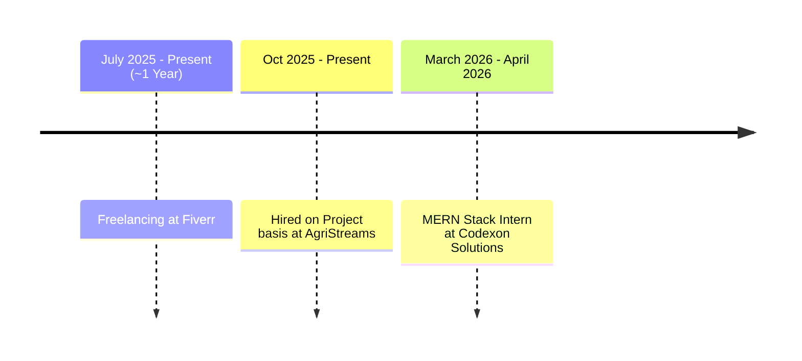

<!--
<table>
  <tr>
    <td>

</td>
  </tr> 
</table>
--> 

 
## Here to Stalk?! Sure.

> I'm an undergrad Software Engineer, currently in my 4th semester. I have been coding an average of 6 hours a day for over 2 years at this point. I can code any project, even the one you are building right now :)
 

<table>
  <tr>
    <td>
      
    </td>
    <td>
      
    </td>
  </tr>
</table>

<!--

  

-->

## My Projects

#### Circuit Simulator -> [ [repository](https://github.com/d-khalid/iris) ]

> One of my recent works. I am still working on it but feel free to take a peek

#### Search Engine -> [ [frontend](https://github.com/shahzaibahmad05/nextsearch-web) | [backend](https://github.com/shahzaibahmad05/nextsearch-api) | [demo](https://www.youtube.com/watch?v=tvpunJ4zmCg) ]

> A webpage that started with a few C++ files. This project had me visit the extremes for performance and memory optimization, and later I ended up adding quite a few interesting features that a search engine should ideally have

 
 

---

## Public Repositories List

> This is a list of my repositories grouped by respective tech stacks. Each project you'll find here is typed out by me. None of the bits are vibe-coded. But it's still a work-in-progress.

  
<code>python</code>

   
  <blockquote>This is the language I like the most, and so, I have typed it the most.</blockquote>
  

    
<code>pyqt</code>

     
    <blockquote>I use PyQt for GUI for desktop apps in python.</blockquote>
    <a href="https://github.com/ShahzaibAhmad05/Calculator"><code>over-engineered calculator</code></a>
     
    <a href="https://github.com/ShahzaibAhmad05/pyinstaller"><code>pyinstaller (GUI wrapper for the original one)</code></a>
     
     
  

  

    
<code>tesseract</code>

     
    <blockquote>It's free and open source. Perfect for screen scanning.</blockquote>
    <a href="https://github.com/ShahzaibAhmad05/seb-overlay"><code>A complete patch for safe browser using OCR (educational purposes only ;)</code></a>
     
     
  

  

    
<code>others</code>

     
    <blockquote>I probably can't group these in any of the above categories, so I put them here. These are special.</blockquote>
    <a href="https://github.com/ShahzaibAhmad05/gitree"><code>gitree (it's a cli-tool I created and I use it regularly)</code></a>
  

   

  
<code>Typescript</code>

   
  <blockquote>Interesting syntax. But that doesn't mean I like javascript.</blockquote>
  

    
<code>Nextjs & Tailwind</code>

     
    <blockquote>I usually use this tech stack for web development.</blockquote>
    <a href="https://github.com/ShahzaibAhmad05/DSA"><code>finance tracker</code></a>
  

   

  
<code>C#</code>

   
  

    
<code>Avalonia (+CommunityToolkit.Mvvm)</code>

     
    <blockquote>Mvvm Toolkit comes in handy when working with Avalonia. It's basically a library that helps implement the Mvvm design pattern better. Avalonia itself is also convenient for desktop app development.</blockquote></blockquote>
    <a href="https://github.com/d-khalid/IRis"><code>Circuit Simulator (with offline AI-features)</code></a>
  

   

  
<code>C++</code>

   
  <blockquote>I don't see any difference in speed compared to python if both are optimized. But explicit types are kind of useful for readability.</blockquote>
  

    
<code>others</code>

     
    <blockquote>No major libraries/frameworks here.</blockquote>
    <a href="https://github.com/ShahzaibAhmad05/DSA"><code>DSA stuff. Well-known and self-proclaimed Algorithms and some Leetcode problems.</code></a>
     
    <a href="https://github.com/Hanzila-Nawazz/virtual-file-system"><code>A virtual file system (created while learning OS fundamentals)</code></a>
  

 

---

## Professional Journey

