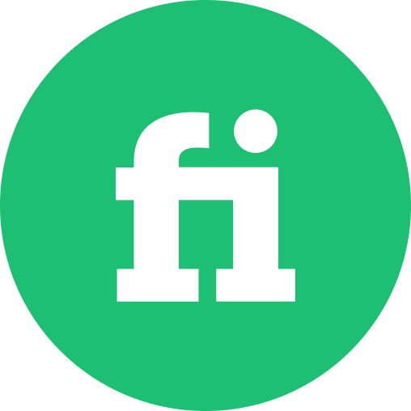
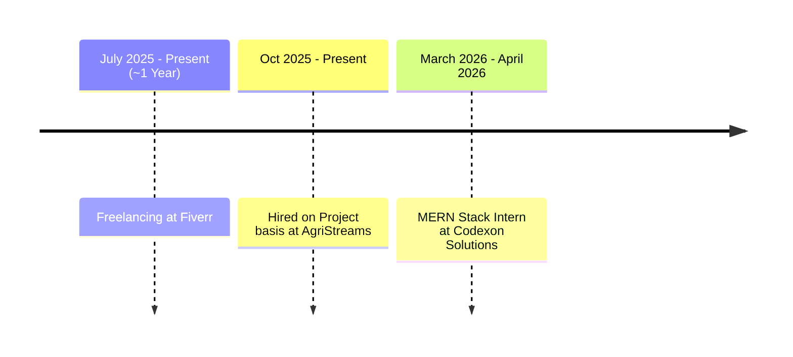

<!--
<table>
  <tr>
    <td>

</td>
  </tr> 
</table>
--> 

 
## Introduction

> I have recently completed my 4th semester as an undergraduate Software Engineer. I have been coding an average of 6 hours a day for approximately 3 years at this point, which puts me to the pile of ergophilics I suppose. I enjoy building/rebuilding software, reading books of documentation, and using frameworks/design patterns to upgrade codebases and find peace and satisfaction in it.

  
Click for a full intro

   
  
> I started out in late 2022 with typing HTML and CSS for 3 months (and a fair bit of what's called JavaScript) for absolutely nothing in exchange but curiousity. Curiousity lead to further curiousity and I ended up learning the basics of C++. Next I remember I was making tools, CLI-based games and all kinds of weird things that were moved close to the recycle bin soon.
>
> One year later, I had to choose a major at [NUST](https://nust.edu.pk/) and I chose Software engineering. First semester was rough, (but that's irrelevant here) I wasn't getting the time to do what I wanted to do. In second semester, I ditched whatever coursework was keeping me busy and started learning python (around end of 2024).
>
> I casually again spent 3 months (about half-a-semester) building a unique python desktop app with absolutely nothing in exchange. The app is still [here](https://github.com/ShahzaibAhmad05/PyAutoMate) on GitHub (caps because I like GitHub and live on it now). I felt accomplished after finishing it. It was a floating icon with nice animations that you could add scripts on in the language I defined in it and those scripts then each bind to a button and a shortcut key.
>
> At the near-end of that semester (start of 2025 as far as I remember) I met [this](https://github.com/d-khalid) person. He was magic. For our semester project I was having a hard time deciding what to do, he pulled off [this](https://github.com/d-khalid/IRis) project. It was truly way above my level of understanding. I could hardly contribute before the project deadline went by. But the following summer, I did contribute, I even re-typed all of the c# codebase myself to prove I can do it.
>
> After this I went to try out ML. Vibe-coding was at peak (or so I thought through wishful thinking) so I used my crap prompting skills to get a YOLO-model to work with identifying objects in Handdrawn logic circuits (wow I trained a model but don't know how I did it, such is the result of vibe-coding).
>
> The next Summer I spent building my social media presence (by this I mean LinkedIn and GitHub ofcourse). 3rd and 4th semesters were full of learning (2025-early 2026). I again casually spent a lot of time building [this](https://github.com/ShahzaibAhmad05/gitree) to sharpen my python skills and maybe get something acceptable open-source and was still somehow okay with getting nothing in exchange. I also built this [search engine](https://github.com/ShahzaibAhmad05/NextSearch-api), but the UI had to be vibe coded because of tight deadlines.
>
> Anyways this was when I learned `React.js`, `Next.js`, `TypeScript` and `TailwindCSS` and all the other web tech keywords. I was able to type out web pages in less than a day and acquired TailwindCSS after my practice with [this](https://github.com/ShahzaibAhmad05/FinTrack). This was made during my 4th semester when I abandoned vibe-coding completely (I still use LLMs in general but only for leverage, most of the time I am just crawling documentation manually to study it).
>
> At the end of my 4th semester, and hence, now, I feel like my software-building skills are developed enough to not be using vibe-coding as an excuse for a midnight deadline. I can build/rebuild about anything with enough context and some discussions with Claude. In fact, I now dislike vibe-coding because of the technical debt it ships with each bit of code. Everything done by an LLM is just so low-quality if not done carefully.
>
> And that's it, that is my intro. I lowkey wish I could give a full introduction like this in interviews but oh well. **Anyways:**

> Summing up, I have spent approximately 2 years on python, 1 year on web tech, 1 year on DOTNET (c#, avalonia, and Mvvm mainly and the years mentioned here overlap ofcourse). I mainly use Cursor (code editor) for coding. (because it's autocomplete is magic and uses the whole codebase as context)

<table>
  <tr>
    <td>
      
    </td>
    <td>
      
    </td>
  </tr>
</table>

## My Projects

#### Circuit Simulator -> [ [repository](https://github.com/d-khalid/iris) ]

> A circuit simulator capable of Simulating a Mini-CPU and generating logic circuits from handdrawn sketches offline by using a custom-built shippable YOLO model.
>
> More importantly, have you seen a circuit simulator with this kind of UI before? This project has a lot of potential long-term which is why I am going to continue to build it.

#### Search Engine -> [ [frontend](https://github.com/shahzaibahmad05/nextsearch-web) | [backend](https://github.com/shahzaibahmad05/nextsearch-api) | [demo](https://www.youtube.com/watch?v=tvpunJ4zmCg) ]

> A webpage that started with a few C++ files. This project had me visit the extremes for performance and memory optimization, and later I ended up adding quite a few interesting features that a search engine should ideally have

 
 

---

## Public Repositories List

> This is a list of my repositories grouped by respective tech stacks. Each project you'll find here is complete and high-quality.

  
<code>python</code>

   
  <blockquote>This is the language I like the most, and so, I have typed it the most.</blockquote>
  

    
<code>pyqt</code>

     
    <blockquote>I use PyQt for GUI for desktop apps in python.</blockquote>
    <a href="https://github.com/ShahzaibAhmad05/Calculator"><code>over-engineered calculator</code></a>
     
    <a href="https://github.com/ShahzaibAhmad05/pyinstaller"><code>pyinstaller (GUI wrapper for the original one)</code></a>
     
     
  

  

    
<code>tesseract</code>

     
    <blockquote>It's free and open source. Perfect for screen scanning.</blockquote>
    <a href="https://github.com/ShahzaibAhmad05/seb-overlay"><code>A complete patch for safe browser using OCR (educational purposes only ;)</code></a>
     
     
  

  

    
<code>others</code>

     
    <blockquote>I probably can't group these in any of the above categories, so I put them here. These are special.</blockquote>
    <a href="https://github.com/ShahzaibAhmad05/gitree"><code>gitree (it's a cli-tool I created and I use it regularly)</code></a>
  

   

  
<code>Typescript</code>

   
  <blockquote>Interesting syntax. But that doesn't mean I like javascript.</blockquote>
  

    
<code>Nextjs & Tailwind</code>

     
    <blockquote>I usually use this tech stack for web development.</blockquote>
    <a href="https://github.com/ShahzaibAhmad05/DSA"><code>finance tracker</code></a>
  

   

  
<code>C#</code>

   
  

    
<code>Avalonia (+CommunityToolkit.Mvvm)</code>

     
    <blockquote>Mvvm Toolkit comes in handy when working with Avalonia. It's basically a library that helps implement the Mvvm design pattern better. Avalonia itself is also convenient for desktop app development.</blockquote></blockquote>
    <a href="https://github.com/d-khalid/IRis"><code>Circuit Simulator (with offline AI-features)</code></a>
  

   

  
<code>C++</code>

   
  <blockquote>I don't see any difference in speed compared to python if both are optimized. But explicit types are kind of useful for readability.</blockquote>
  

    
<code>others</code>

     
    <blockquote>No major libraries/frameworks here.</blockquote>
    <a href="https://github.com/ShahzaibAhmad05/DSA"><code>DSA stuff. Well-known and self-proclaimed Algorithms and some Leetcode problems.</code></a>
     
    <a href="https://github.com/Hanzila-Nawazz/virtual-file-system"><code>A virtual file system (created while learning OS fundamentals)</code></a>
  

 

---

## Professional Journey

